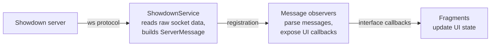
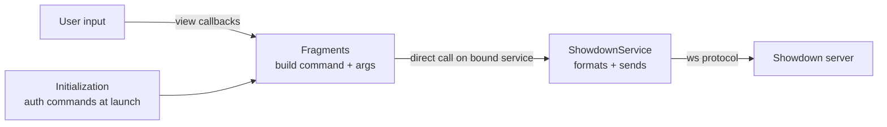

<h1>
  
  Unofficial Showdown! Client
</h1>


> [!NOTE]
> This is an **unofficial**, fan-made client and is **not affiliated with**
> Smogon, the Pokémon Showdown project, Nintendo, Creatures Inc. or GAME FREAK.
> It is a native Android companion app for
> [play.pokemonshowdown.com](https://play.pokemonshowdown.com).

## Contents
- [Introduction](#introduction)
- [Features](#features)
- [Building](#building)
- [Updating local data (new generations)](#updating-local-data-new-generations)
- [Technical overview](#technical-overview)
- [Notes](#notes)
- [Contributing](#contributing)
- [TODO](#TODO)
- [Credits](#credits)
- [License](#license)

## Introduction
This repository contains the source code for the **unofficial Pokémon Showdown**
Android client. It is written mostly in **Kotlin** on top of the Android
framework; it was formerly written in Java, so you'll still find some components
written in Java.

> **Why a native app when *play.pokemonshowdown.com* already supports mobile devices?**
> The web client does its best to support small screen sizes — and does it pretty
> well — but the user experience is still far from what a native app can provide.

**What this client is** — a client with a convenient UI suited to mobile
devices, without losing any part of the experience you would have on the
official client (tips, types, stats, and so on).

**What this client is not** — a replacement for the desktop/web client. It is
more of a companion app, letting you play Showdown anywhere without needing your
desktop computer.

## Features
- Connect to the official server and log in (guest or registered account).
- Find, accept and cancel battles and challenges.
- Full single and double battle UI with tips, types, stats, status, weather and
  terrain overlays, plus **Terastallization** and graphical entry hazards.
- **Native move animations**: moves play Pokémon Showdown's actual on-field
  animations — particle effects, sprite lunges and screen flashes — rendered
  natively, with the `fx` graphics fetched at runtime.
- Move **type-effectiveness** hints computed against the foe's current
  (Tera-aware) types.
- **Revealed-move tracking**: the opponent's moves are remembered as they are
  used and listed in the Pokémon tip popup, persisting across switches.
- **Tappable team icons**: tap-and-hold an already-appeared team icon in the
  player info bars to review that Pokémon (including its revealed moves) without
  waiting for it to return to the field.
- Battle replays with turn-by-turn playback controls.
- Spectate ongoing battles.
- **Flip viewpoint**: when spectating or watching a replay, swap the on-screen
  perspective so the other player is shown on the near (bottom) side.
- Chat rooms.
- Team builder with Smogon import/export.

## Building
**Requirements**
- JDK **17** (required by Android Gradle Plugin 8.7.3 / Gradle 8.9)
- Android SDK with `compileSdk` **35** (min SDK 21)
- A device or emulator running Android 5.0+ (API 21+)

The Gradle wrapper pins the correct Gradle version, so you only need the JDK and
the Android SDK installed.

```bash
# Build a debug APK
./gradlew assembleDebug

# Build and install on a connected device / emulator
./gradlew installDebug

# Run the checks (lint + unit tests)
./gradlew build
```

The generated APK is written to
`psclient/build/outputs/apk/debug/psclient-debug.apk`.

> Pokémon sprites, battle backgrounds and field-effect graphics are fetched at
> runtime from `play.pokemonshowdown.com`, so an internet connection is required
> both to play and to display battle assets.

## Updating local data (new generations)
For fast start-up, frequently accessed data (dex, moves, learnsets, icon
sheets) is bundled locally. When a new generation ships on Showdown, regenerate
these assets:

| File | Generator script |
|---|---|
| `psclient/src/main/res/raw/dex.json` | `build-tools/build_dex.py` |
| `psclient/src/main/res/raw/dex_icon_indexes.json` | `build-tools/build_dex_icon_indexes.py` |
| `psclient/src/main/res/raw/dex_icons_sheet.png` | `build-tools/update_icons_sheet.py` |
| `psclient/src/main/res/raw/item_icons_sheet.png` | `build-tools/update_icons_sheet.py` |
| `psclient/src/main/res/raw/learnsets.json` | `build-tools/build_learnsets.py` |
| `psclient/src/main/res/raw/moves.json` | `build-tools/build_moves.py` |
| `psclient/src/main/res/raw/battle_animations.json` | `build-tools/build_battle_animations.py` |

**Prerequisites:** Python 3 + `pip install requests`

```bash
cd build-tools
python3 update_icons_sheet.py
python3 build_dex.py
python3 build_dex_icon_indexes.py
python3 build_learnsets.py
python3 build_moves.py
```

Each script fetches live data from `play.pokemonshowdown.com` and asks for
confirmation (`y`) before overwriting the local file. Without these updates,
newer Pokémon won't appear in the team-builder autocomplete and their
types/stats will be missing.

The **move-animation** data (`battle_animations.json`) is regenerated
separately: it additionally requires **Node.js** (used to execute Showdown's
animation script) and is run from the repository root rather than `build-tools/`:

```bash
# from the repository root; requires Node.js in addition to Python 3
python3 build-tools/build_battle_animations.py
```

Only animation *data* is bundled; the `fx` particle graphics it references are
fetched at runtime and are not redistributed (see [NOTICE](NOTICE)).

## Technical overview
A brief tour of the packages and their main components, to help you find how
things fit together.

### Project structure
Base package: `com.majeur.psclient`

| Package | Responsibility |
|---|---|
| [`.ui`](psclient/src/main/java/com/majeur/psclient/ui) | Activities, fragments and dialogs. [`MainActivity`](psclient/src/main/java/com/majeur/psclient/ui/MainActivity.kt) sets up the fragments and the connection to `ShowdownService`; each `*Fragment` drives its UI by implementing its message-observer callbacks. Includes the team builder ([`.teambuilder`](psclient/src/main/java/com/majeur/psclient/ui/teambuilder)). |
| [`.service`](psclient/src/main/java/com/majeur/psclient/service) | Everything Showdown-protocol related. [`ShowdownService`](psclient/src/main/java/com/majeur/psclient/service/ShowdownService.kt) owns the WebSocket and authentication; the [`.observer`](psclient/src/main/java/com/majeur/psclient/service/observer) package parses and dispatches server messages ([`GlobalMessageObserver`](psclient/src/main/java/com/majeur/psclient/service/observer/GlobalMessageObserver.kt), [`RoomMessageObserver`](psclient/src/main/java/com/majeur/psclient/service/observer/RoomMessageObserver.kt), [`BattleRoomMessageObserver`](psclient/src/main/java/com/majeur/psclient/service/observer/BattleRoomMessageObserver.kt), [`ChatRoomMessageObserver`](psclient/src/main/java/com/majeur/psclient/service/observer/ChatRoomMessageObserver.kt)). |
| [`.io`](psclient/src/main/java/com/majeur/psclient/io) | Content loading via [`AssetLoader`](psclient/src/main/java/com/majeur/psclient/io/AssetLoader.kt): local dex/move data and dex icons, web sprites through [`GlideHelper`](psclient/src/main/java/com/majeur/psclient/io/GlideHelper.kt), battle text ([`BattleTextBuilder`](psclient/src/main/java/com/majeur/psclient/io/BattleTextBuilder.java)) and audio ([`BattleAudioManager`](psclient/src/main/java/com/majeur/psclient/io/BattleAudioManager.java)). |
| [`.model`](psclient/src/main/java/com/majeur/psclient/model) | Data classes (battle state, Pokémon, types, …). |
| [`.widget`](psclient/src/main/java/com/majeur/psclient/widget) | Custom UI components such as [`BattleLayout`](psclient/src/main/java/com/majeur/psclient/widget/BattleLayout.kt) and [`StatusView`](psclient/src/main/java/com/majeur/psclient/widget/StatusView.kt). |
| [`.battleanim`](psclient/src/main/java/com/majeur/psclient/battleanim) | The native move-animation engine: [`BattleAnimProjection`](psclient/src/main/java/com/majeur/psclient/battleanim/BattleAnimProjection.kt) (a port of Showdown's `BattleScene` coordinate projection and easings), [`BattleAnimController`](psclient/src/main/java/com/majeur/psclient/battleanim/BattleAnimController.kt) (plays an animation sequence) and [`AnimParticle`](psclient/src/main/java/com/majeur/psclient/battleanim/AnimParticle.kt) (a drawn particle). Data comes from `res/raw/battle_animations.json`. |
| [`.util`](psclient/src/main/java/com/majeur/psclient/util) | Utilities, including minimal [`html`](psclient/src/main/java/com/majeur/psclient/util/html) rendering for `|html|` / `|raw|` messages and Smogon team [parsing](psclient/src/main/java/com/majeur/psclient/util/smogon/SmogonTeamParser.kt) and [building](psclient/src/main/java/com/majeur/psclient/util/smogon/SmogonTeamBuilder.kt). |

### Architecture
**Incoming data flow**



**Outgoing data flow**



## Notes
### Limitations
- **One battle at a time** — the UI is intentionally designed around a single
  active battle (which makes sense on mobile); the code is structured to leave
  room for extending this later.
- **Battle formats** — singles and doubles are implemented and tested; triples
  build and run "as is" but are untested.
- **English only** — Showdown is English-only with no localization planned, so
  most UI strings are hard-coded rather than placed in `res/values/strings.xml`.
  A localized Showdown client would be largely pointless and risk a partially
  translated UI.

### Data files
To keep the binary small and maintainable, data is fetched from the Showdown
server whenever practical. For heavily or repeatedly accessed data
(dex/move/Pokémon details), JSON files are bundled locally to keep loading times
low. Dex icons are stored locally too, so a single region of the icon sheet can
be decoded instead of loading the whole sheet. See
[Updating local data](#updating-local-data-new-generations) for how to
regenerate these assets.

### Web protocols
Every HTTP connection uses HTTPS (`https:`) and the WebSocket connection uses
`wss:`.

## Contributing
Contributions are very welcome! Please match the existing coding patterns and
strongly test your changes — ideally against a live battle — before opening a
pull request. Bug reports and feature ideas via issues are appreciated.

## TODO
- **Route Glide through the app's OkHttp client** — battle sprites, backgrounds
  and `fx` graphics are currently fetched with Glide's default networking. Wiring
  Glide through the existing tuned OkHttp client (via the
  `glide-okhttp3-integration` library) would add real retry/connection-pool
  behaviour and share the IPv4-first + `Origin` header tuning, making sprite
  downloads more reliable on slow/congested connections than the current raised
  timeout alone.
- **Test the team builder on newer Android versions** — the team builder hasn't
  been re-tested against recent Android releases yet; its drag-and-drop, Smogon
  import/export and validation flows need a pass to confirm they still behave
  correctly (and to catch any layout or storage regressions).
- **Room user list** — handle the `@!` (away) marker and sort users by rank;
  usernames are already md5-coloured.
- **More unit tests** — not a priority, but always welcome.
- Anything else that can be integrated nicely.

## Credits
- [Zarel](https://github.com/Zarel) and contributors — for Pokémon Showdown.
- [NamTThai](https://github.com/NamTThai) — for Java code translated from the
  web client.
- Everyone on the [Smogon thread](https://www.smogon.com/forums/threads/alpha02-need-testers-unofficial-showdown-android-client.3654298)
  — for testing and bug reporting.
- [pokemonshowdown.com/credits](https://pokemonshowdown.com/credits)
- Type icons by [majeur01 on DeviantArt](https://www.deviantart.com/majeur01/art/Pokemon-Types-Icons-819866719).

## License
Licensed under the **Apache License, Version 2.0** — see [LICENSE](LICENSE) and
[NOTICE](NOTICE).

```
Copyright 2020 MajeurAndroid
Copyright 2024-2026 Unofficial Showdown Client (Gen 9) fork contributors

Licensed under the Apache License, Version 2.0 (the "License");
you may not use this file except in compliance with the License.
You may obtain a copy of the License at

    http://www.apache.org/licenses/LICENSE-2.0

Unless required by applicable law or agreed to in writing, software
distributed under the License is distributed on an "AS IS" BASIS,
WITHOUT WARRANTIES OR CONDITIONS OF ANY KIND, either express or implied.
See the License for the specific language governing permissions and
limitations under the License.
```
