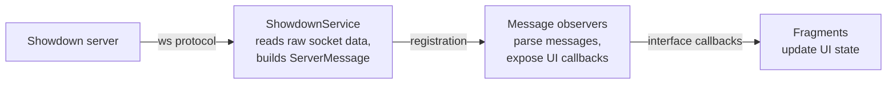
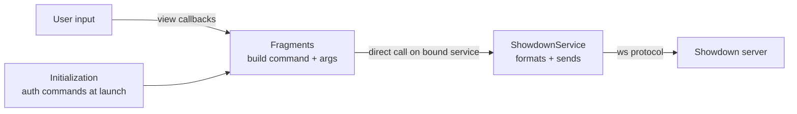

<h1>
  
  Unofficial Showdown! Client — Gen 9 fork
</h1>

> A fork that revives the abandoned
> [Android Unofficial Showdown Client](https://github.com/MajeurAndroid/Android-Unofficial-Showdown-Client)
> and brings it up to date with the modern Pokémon Showdown server,
> **Generation 9** data and **Terastallization**.


> [!NOTE]
> This is an **unofficial**, fan-made client and is **not affiliated with**
> Smogon, the Pokémon Showdown project, Nintendo, Creatures Inc. or GAME FREAK.
> It is a native Android companion app for
> [play.pokemonshowdown.com](https://play.pokemonshowdown.com).

## Contents
- [About this fork](#about-this-fork)
- [What's new](#whats-new)
- [Features](#features)
- [Building](#building)
- [Updating local data (new generations)](#updating-local-data-new-generations)
- [Project structure](#project-structure)
- [Architecture](#architecture)
- [Limitations](#limitations)
- [Contributing](#contributing)
- [Credits](#credits)
- [License](#license)

## About this fork
The upstream project hadn't been updated in years and, in the meantime, the
public Pokémon Showdown server changed enough to break sign-in and a few other
flows, while the Pokédex moved on by several generations.

This fork:
- restores connectivity with the **current** Showdown server,
- updates the bundled data to **Generation 9**,
- adds the **Terastallization** battle gimmick and move **type-effectiveness**
  hints,
- and improves the in-battle visuals (multiple backgrounds and graphical entry
  hazards) to better match the web client.

The app remains a **companion** to the desktop/web client — convenient for
playing or spectating on the go — not a full replacement for it.

## What's new
A short summary (see [CHANGELOG.md](CHANGELOG.md) for the full list):

- 🟣 **Terastallization** — decision toggle, on-field `TERA <TYPE>` badge,
  tooltips and toasts.
- 📊 **Move effectiveness** — coloured multipliers on move buttons, in tooltips
  and in the team popup, computed against the foe's current (Tera-aware) types.
- 🖼️ **Battle backgrounds** — the same multi-backdrop selection as the web
  client, loaded at runtime.
- 🕸️ **Graphical entry hazards** — Spikes, Toxic Spikes, Stealth Rock,
  Sticky Web and G-Max Steelsurge drawn on the field with the official sprites.
- 🔌 **Protocol fixes** — modern login (multi-line RSA assertion), PM-based
  challenges, hardened JSON parsing, better error handling.
- 🧬 **Gen 9 data** — dex, moves, learnsets and icon sheets regenerated;
  HOME artwork and hyphenated-name sprite fixes.

## Features
- Connect to the official server, log in (guest or registered account).
- Find/accept/cancel battles and challenges.
- Full single and double battle UI with tips, types, stats, status, weather and
  terrain overlays, and now Tera + graphical hazards.
- Battle replays.
- Chat rooms.
- Team builder with Smogon import/export.

## Building
**Requirements**
- JDK **17** (required by Android Gradle Plugin 7.4.2 / Gradle 7.6.4)
- Android SDK with `compileSdk` **29** (min SDK 21)
- A device or emulator running Android 5.0+ (API 21+)

The Gradle wrapper pins the correct Gradle version, so you only need the JDK and
the Android SDK installed.

```bash
# Build a debug APK
./gradlew assembleDebug

# Build and install on a connected device / emulator
./gradlew installDebug

# Run the checks (lint + unit tests)
./gradlew build
```

The generated APK is written to
`psclient/build/outputs/apk/debug/psclient-debug.apk`.

> Pokémon sprites, battle backgrounds and field-effect graphics are fetched at
> runtime from `play.pokemonshowdown.com`, so an internet connection is required
> both to play and to display battle assets.

## Updating local data (new generations)
For fast start-up, frequently accessed data (dex, moves, learnsets, icon
sheets) is bundled locally. When a new generation ships on Showdown, regenerate
these assets:

| File | Generator script |
|---|---|
| `psclient/src/main/res/raw/dex.json` | `build-tools/build_dex.py` |
| `psclient/src/main/res/raw/dex_icon_indexes.json` | `build-tools/build_dex_icon_indexes.py` |
| `psclient/src/main/res/raw/dex_icons_sheet.png` | `build-tools/update_icons_sheet.py` |
| `psclient/src/main/res/raw/item_icons_sheet.png` | `build-tools/update_icons_sheet.py` |
| `psclient/src/main/res/raw/learnsets.json` | `build-tools/build_learnsets.py` |
| `psclient/src/main/res/raw/moves.json` | `build-tools/build_moves.py` |

**Prerequisites:** Python 3 + `pip install requests`

```bash
cd build-tools
python3 update_icons_sheet.py
python3 build_dex.py
python3 build_dex_icon_indexes.py
python3 build_learnsets.py
python3 build_moves.py
```

Each script fetches live data from `play.pokemonshowdown.com` and asks for
confirmation (`y`) before overwriting the local file. Without these updates,
newer Pokémon won't appear in the team-builder autocomplete and their
types/stats will be missing.

## Project structure
Base package: `com.majeur.psclient`

| Package | Responsibility |
|---|---|
| [`.ui`](psclient/src/main/java/com/majeur/psclient/ui) | Activities, fragments and dialogs. Fragments implement the message-observer callbacks to update the UI. Includes [`.teambuilder`](psclient/src/main/java/com/majeur/psclient/ui/teambuilder). |
| [`.service`](psclient/src/main/java/com/majeur/psclient/service) | Everything Showdown-protocol related. [`ShowdownService`](psclient/src/main/java/com/majeur/psclient/service/ShowdownService.kt) owns the WebSocket and authentication; [`.observer`](psclient/src/main/java/com/majeur/psclient/service/observer) parses and dispatches server messages. |
| [`.io`](psclient/src/main/java/com/majeur/psclient/io) | Content loading: local dex/move data and dex icons, plus web sprites via Glide ([`GlideHelper`](psclient/src/main/java/com/majeur/psclient/io/GlideHelper.kt)), battle text and audio. |
| [`.model`](psclient/src/main/java/com/majeur/psclient/model) | Data classes (battle state, Pokémon, types, …). |
| [`.widget`](psclient/src/main/java/com/majeur/psclient/widget) | Custom UI components such as [`BattleLayout`](psclient/src/main/java/com/majeur/psclient/widget/BattleLayout.kt) and [`StatusView`](psclient/src/main/java/com/majeur/psclient/widget/StatusView.kt). |
| [`.util`](psclient/src/main/java/com/majeur/psclient/util) | Utilities, including minimal [`html`](psclient/src/main/java/com/majeur/psclient/util/html) rendering and Smogon team parsing/building. |

The app is written mostly in **Kotlin**, with some original components still in
Java.

## Architecture
**Incoming data flow**



**Outgoing data flow**



## Limitations
- **One battle at a time** — the UI is intentionally designed around a single
  active battle (sensible on mobile); the code leaves room to extend this.
- **Battle formats** — singles and doubles are supported and tested; triples
  build but are untested.
- **English only** — Showdown itself is English-only, so UI strings are not
  localized.
- Spectator mode works but some tip/popup behaviour can still be rough.

## Contributing
Contributions are welcome. Please match the existing code style and test your
changes (ideally against a live battle) before opening a pull request. Bug
reports and feature ideas via issues are appreciated.

## Credits
- [Zarel](https://github.com/Zarel) and contributors — for Pokémon Showdown.
- [MajeurAndroid](https://github.com/MajeurAndroid) — for the original
  Android client this fork is based on.
- [NamTThai](https://github.com/NamTThai) — for Java code translated from the
  web client.
- [pokemonshowdown.com/credits](https://pokemonshowdown.com/credits)
- Type icons by [majeur01 on DeviantArt](https://www.deviantart.com/majeur01/art/Pokemon-Types-Icons-819866719).

## License
Licensed under the **Apache License, Version 2.0** — see [LICENSE](LICENSE) and
[NOTICE](NOTICE).

```
Copyright 2020 MajeurAndroid
Copyright 2024-2026 Unofficial Showdown Client (Gen 9) fork contributors

Licensed under the Apache License, Version 2.0 (the "License");
you may not use this file except in compliance with the License.
You may obtain a copy of the License at

    http://www.apache.org/licenses/LICENSE-2.0

Unless required by applicable law or agreed to in writing, software
distributed under the License is distributed on an "AS IS" BASIS,
WITHOUT WARRANTIES OR CONDITIONS OF ANY KIND, either express or implied.
See the License for the specific language governing permissions and
limitations under the License.
```
